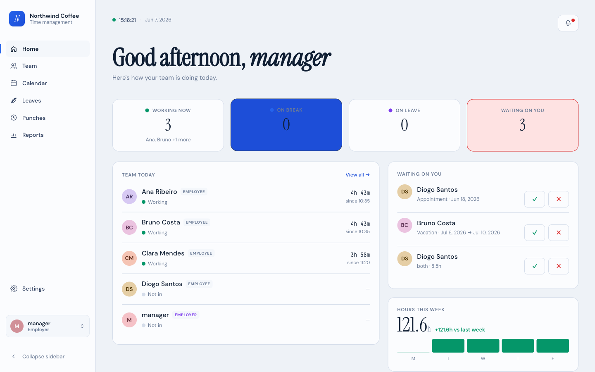
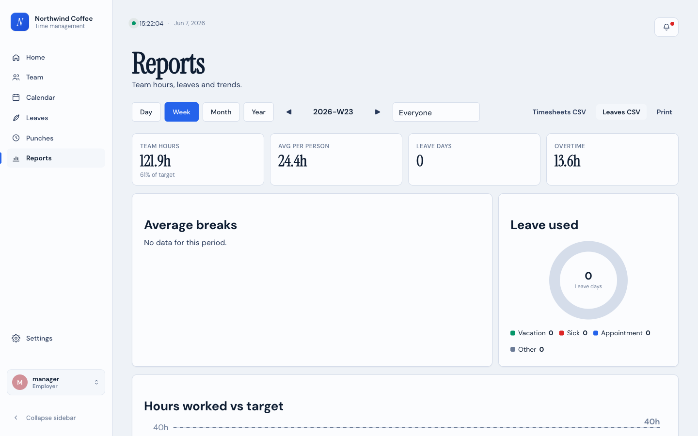
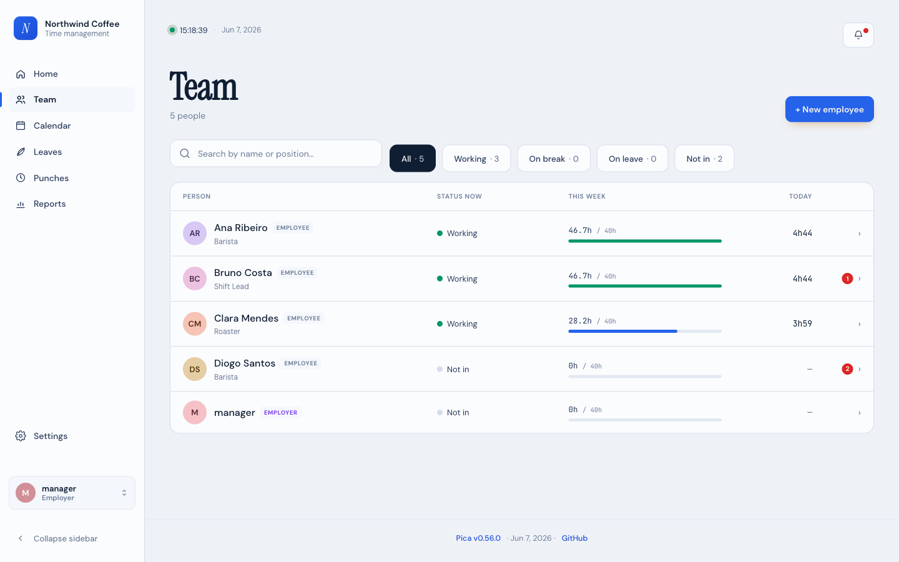

# Pica — Time Management

> Self-hosted time tracking for small teams that runs on **Node.js alone** —
> zero npm dependencies, zero build steps, zero external database. Just
> `node server.js`.

[](./LICENSE)


<p align="center">
  
</p>

Clock in/out, leaves, time corrections, reports, and a calendar — encrypted at
rest, bilingual (English / European Portuguese), installable as a PWA, and small
enough to run on a laptop, a Raspberry Pi, or a tiny VPS.

📜 **[See RELEASES.md](./RELEASES.md)** for the full version history
and what's changed in each iteration.

---

## What it does

A self-hostable time tracker for small teams (≤ 50 employees):

- **Clock in / clock out** with optional comments and geolocation
- **Leaves** in days or hours (vacation, sick, appointment, other),
  with employer approval flow and per-employee allowance caps
- **Time corrections** when someone forgets to clock — with a
  bank-of-hours mechanic for unjustified manual entries
- **Reports** with per-day / week / month aggregations and CSV export
- **Multi-language**: English and European Portuguese, switchable
  per user
- **Dashboard widgets**: at-a-glance pending approvals, who's working
  today, who's on leave, today's hours, bank balance
- **PWA** with offline punch queue
- **Encryption at rest** for everything that's actually sensitive

It does NOT do payroll, taxes, social-security integrations,
multi-tenant SaaS, or anything that would require a build step.

---

## A look at Pica

| | |
|:---:|:---:|
| **Clock in / out** with location & comments | **Team calendar** with privacy-aware leave |
|  |  |
| **Reports** — KPIs, charts, CSV, print-to-PDF | **Team management** for the employer |
|  |  |

More walkthrough screenshots are in the
[user guide](./docs/user-guide.md) and [admin guide](./docs/admin-guide.md).

---

## Running

```bash
$ node server.js
Passphrase:  ********
Pica listening on http://localhost:8080
```

That's it. No `npm install`, no build step. **Put it behind a
reverse proxy with TLS in production** — the
[deployment guide](./docs/deployment.md) has copy-pasteable Caddy / nginx /
systemd / Windows-service samples for Linux and Windows 11, and the
[security doc](./docs/security.md#transport) covers why.

For automation:

```bash
$ PICA_PASSPHRASE='your-passphrase' node server.js
```

The passphrase is at least 8 characters. On first boot you'll be
prompted to create the first employer account via the setup
wizard at `/setup`.

New to using Pica? Employees should start with the
[user guide](./docs/user-guide.md), and whoever runs the company with the
[admin guide](./docs/admin-guide.md) — both are illustrated walkthroughs.

---

## Repository layout

The shape at a glance — a full annotated tree is in
[architecture.md → Repository layout](./docs/architecture.md#repository-layout).

```
pica/
├── server.js              # entry point
├── src/                   # backend (router, http, crypto, auth, storage, routes)
├── public/                # frontend (HTML, CSS, ES modules — no build)
├── tests/                 # node:test-style suites, no framework
├── docs/                  # the deeper docs (see below)
├── deploy/                # sample deploy configs
├── README.md              # this file
├── RELEASES.md            # version history
└── package.json           # version + releaseDate (footer reads these)
```

---

## Documentation

For anything beyond running the app, the deeper docs live in
[`docs/`](./docs/):

| Doc                                          | What's in it                                                          |
|----------------------------------------------|-----------------------------------------------------------------------|
| **[user-guide.md](./docs/user-guide.md)**     | For employees: signing in, clocking, leave, calendar, preferences      |
| **[admin-guide.md](./docs/admin-guide.md)**   | For employers/admins: setup, team, approvals, reports, settings, backups, security |
| **[architecture.md](./docs/architecture.md)** | Code organization, request flow, storage shape, tech choices         |
| **[security.md](./docs/security.md)**         | Threat model, encryption, sessions, deployment expectations          |
| **[deployment.md](./docs/deployment.md)**     | Production deploy: TLS, reverse proxy, running as a service, hardening |
| **[development.md](./docs/development.md)**   | Conventions, how-to recipes (add a page, translation, route, test)   |
| **[roadmap.md](./docs/roadmap.md)**           | Milestone status, what's done, what's next                           |

The per-version changelog is [RELEASES.md](./RELEASES.md).

Per-route API shapes and per-storage-module field schemas are in the
file headers at the top of each `src/routes/*.js` and
`src/storage/*.js` file — no separate API doc.

### For AI-assisted development

If you're working on Pica with an AI coding assistant (Claude Code,
Cursor, etc.), keep a `CLAUDE.md` at the repo root capturing the
conventions and invariants that aren't obvious from reading
individual files. This checkout's `CLAUDE.md` (and a `docs/handoff.md`
state snapshot) are local and gitignored by design — they're operator
notes for *this* working copy, not shipped with the repo.

---

## Goals and non-goals

### Goals

Give small teams and solo employers a lightweight, self-hostable
time-tracking tool that:

- runs anywhere Node.js runs (laptop, Raspberry Pi, tiny VPS)
- stores everything as plain files — no database to install,
  migrate, or back up separately
- keeps each employee's data private: only the employer (admin) and
  the employee themselves can see their details
- works smoothly on a smartphone
- speaks Portuguese and English

The philosophy is deliberately linear and simple: prefer clarity
over cleverness, prefer files over frameworks, prefer doing less
well over doing more poorly.

### Non-goals

- Multi-tenant SaaS features
- Payroll calculation, taxes, or social-security integrations
- Real-time collaboration / websockets
- Any dependency on a build toolchain (no webpack, no TypeScript,
  no bundlers)
- Defending against a compromised server process or a malicious
  admin

---

## Status

See [roadmap.md](./docs/roadmap.md)

---

## License

MIT
