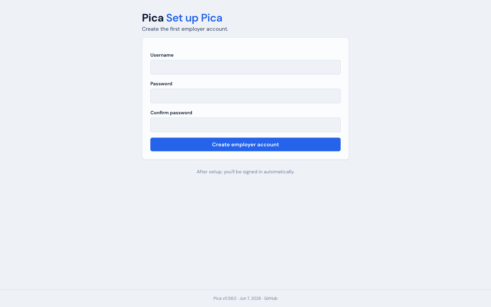
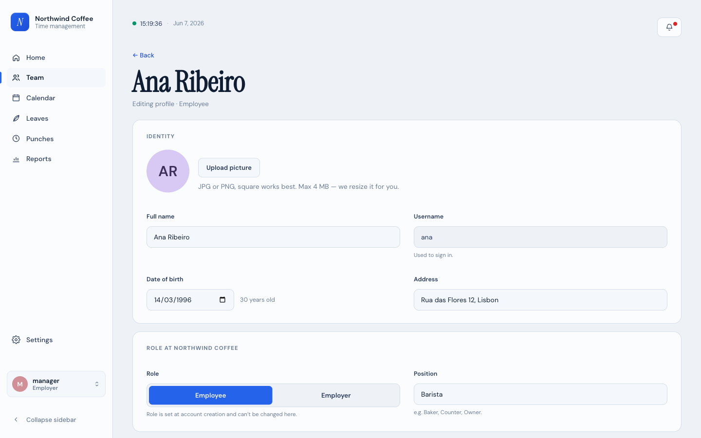
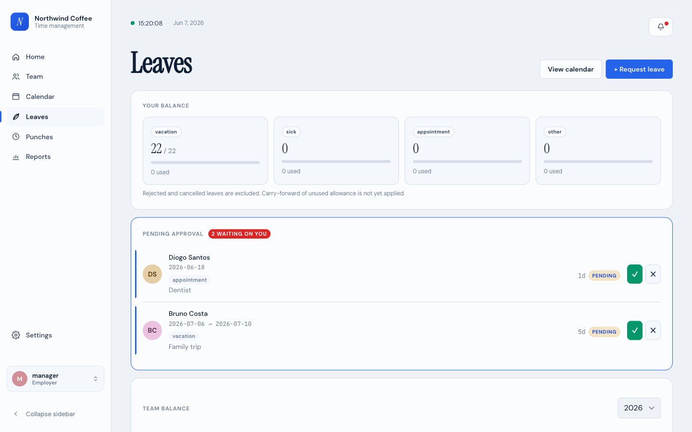
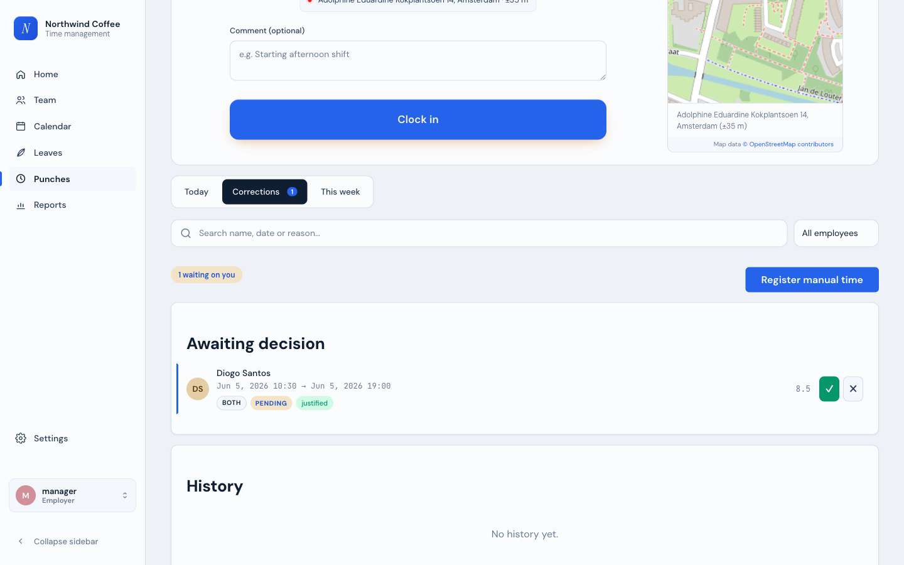
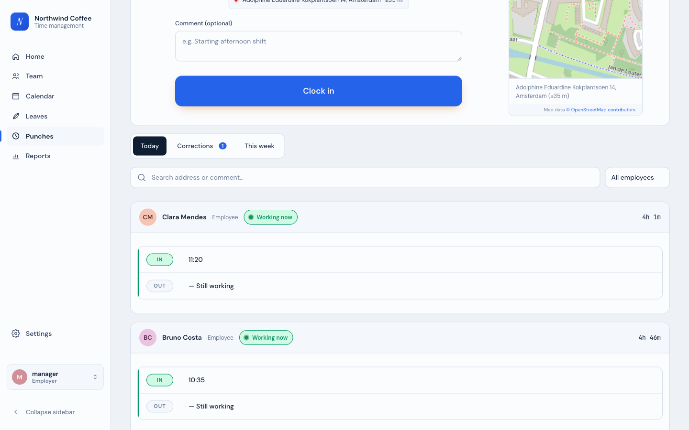
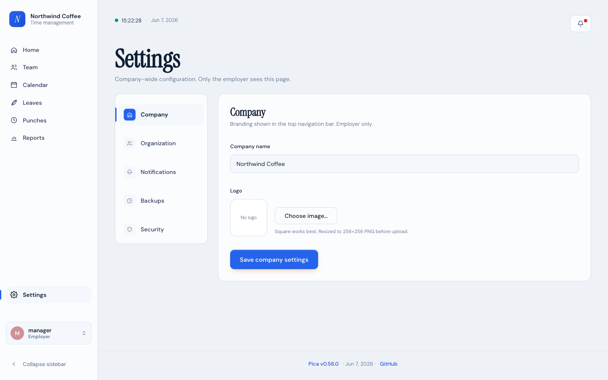
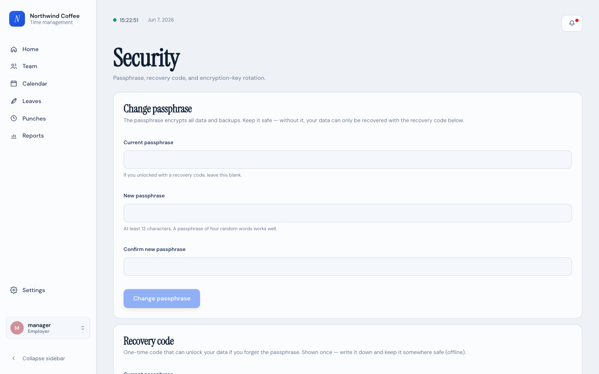

# Pica — Admin guide

This guide is for the **employer / admin**: the person who sets up the
company, adds people, approves requests, runs reports, and looks after
backups and security. It assumes no technical background — for installing
and running the server itself, see the
[deployment guide](./deployment.md).

Just clocking in and requesting leave? See the
[User guide](./user-guide.md) instead.

The screenshots use the default light theme and fictional sample data
("Northwind Coffee").

## Contents

- [First-time setup](#first-time-setup)
- [Your dashboard](#your-dashboard)
- [Managing your team](#managing-your-team)
- [Approving leave](#approving-leave)
- [Approving time corrections](#approving-time-corrections)
- [Seeing who's working](#seeing-whos-working)
- [Reports](#reports)
- [Settings](#settings)
- [Backups](#backups)
- [Security](#security)

---

## First-time setup

The very first time Pica is opened, it asks you to create the company's
first account — yours, as the employer.

Choose a username and password and you're signed in automatically. From
here you add everyone else.

Behind this screen sits the most important thing to understand about
Pica: when the server first started, it created a **passphrase** that
encrypts all of your company's data and backups. **If that passphrase is
lost and you haven't saved a recovery code, the data cannot be
recovered** — there is no back door, by design. Generate and store a
recovery code early (see [Security](#security)). The full encryption
story is in the [security doc](./security.md).

---

## Your dashboard

**Home** gives you the state of the company right now.

- The cards along the top count who's **working now**, **on break**, **on
  leave**, and how many requests are **waiting on you**.
- **Team today** lists each person with their current status.
- **Waiting on you** shows pending leave and correction requests with
  **✓ / ✗** buttons so you can approve or reject right here.

---

## Managing your team

Open **Team** to see everyone, search by name or position, and filter by
status. Choose **New employee** to add someone.

When you add a person you set a username and a temporary password — give
those to them, and they'll be prompted to choose their own password on
first sign-in. Selecting anyone opens their record, where you can review
their hours and pending items, **reset their password**, or open the
profile editor.

In the profile you can edit their details, upload a picture, and set their
position. A few things worth knowing:

- The **role** (Employee / Employer) is fixed when the account is created
  and can't be changed here.
- To off-board someone, **deactivate** them. Deactivation is reversible:
  it blocks their sign-in and ends their sessions immediately, but keeps
  all their records. You can reactivate them later from the team list.
- **Deleting** an account is permanent and is only allowed *after* the
  account has been deactivated — a deliberate two-step guard against
  accidental loss.

---

## Approving leave

Pending leave requests appear in **Waiting on you** on your dashboard and
in the **Pending approval** section of **Leaves**.

Use the **✓** to approve or the **✗** to reject. If approving would
overlap with someone else's time off, Pica warns you first. When you
reject, you can add a short note explaining why. The **Team balance**
section below shows everyone's remaining allowance for the year.

---

## Approving time corrections

When someone forgets to clock, they send a **time correction**. Find these
under the **Corrections** tab on the **Punches** page.

Each pending request shows the times the employee says they worked and
their reason. Approve it and the time is written into their record;
reject it and nothing changes. You can also **register manual time** on
someone's behalf from here.

---

## Seeing who's working

The **Today** tab on the **Punches** page shows everyone's day — who's
clocked in, when they started, and the sessions they've logged.

Use the search box or the **All employees** picker to focus on one person,
and the **This week** tab for the week's totals.

---

## Reports

**Reports** turns the raw clock and leave data into a dashboard.

- Switch between **Day / Week / Month / Year** and step through periods
  with the arrows. The picker on the right scopes to **Everyone** or one
  person.
- The cards summarise **team hours**, **average per person**, **leave
  days**, and **overtime** for the period.
- The charts cover average breaks, leave used by type, and hours worked
  against target.
- **Timesheets CSV** and **Leaves CSV** download the underlying data.
  There's no server-generated PDF — use your browser's **Print → Save as
  PDF** for a printable copy.

The punctuality figures (who's running late) come from the **expected
start time** and **grace** you set in Settings.

---

## Settings

**Settings** is where company-wide configuration lives. Only the employer
sees this page. It's split into tabs down the left.

- **Company** — the company name and logo shown in the top bar.
- **Organization** — working time (the **expected start time** and
  **grace minutes** that drive the punctuality watchlist), leave
  allowances, and any **blocked days** when leave can't be booked.
- **Notifications** — email (SMTP) settings, with a **Test** button to
  send yourself a check. Until this is configured, Pica sends no email.
- **Backups** — see below.
- **Security** — a shortcut to the Security page.

---

## Backups

Under **Settings → Backups** you can create a backup on demand, schedule
automatic ones, and restore from a backup file. Backups are encrypted
with the same passphrase that protects your data.

Two things to keep in mind, stated plainly:

- **A restore needs a server restart to take effect.** After you restore,
  Pica locks itself down until the server is restarted with the restored
  data in place.
- **`config.json` is not included in a backup** — only your `data/` is.
  That file holds install-specific settings and stays tied to the
  machine, not the backup.

---

## Security

The **Security** page handles the passphrase, the recovery code, and
encryption-key rotation. It's deliberately a standalone page, separate
from Settings.

- **Change passphrase** — replace the passphrase that encrypts all data
  and backups. Keep the new one safe.
- **Recovery code** — generate a one-time code that can unlock your data
  if you ever forget the passphrase. It's shown **once**: write it down
  and store it offline, somewhere separate from the server. This is the
  only thing that can rescue you from a lost passphrase — without it, lost
  means lost.
- **Key rotation** and **wipe-reset** let you re-key the data or, as a
  last resort, start over. These are powerful operations; read the
  on-screen warnings and the [security doc](./security.md) before using
  them.

---

_Admins, that's the tour. Point your team at the
[User guide](./user-guide.md) for the day-to-day basics._

_Last touched in 0.57.0._
