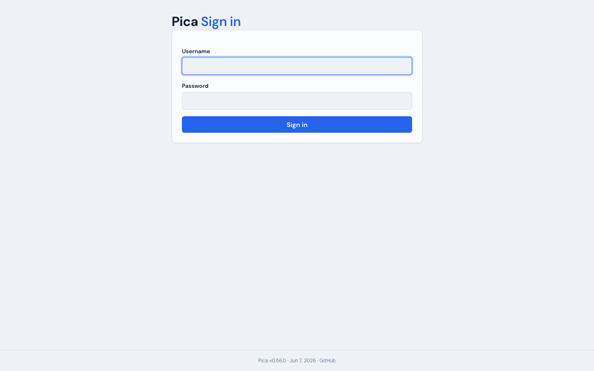
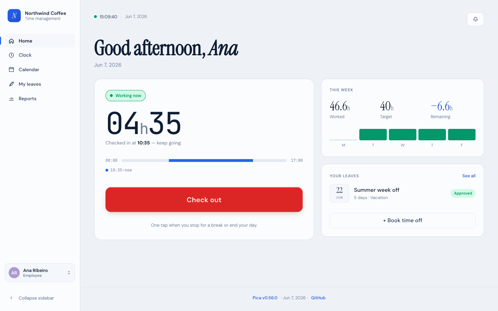
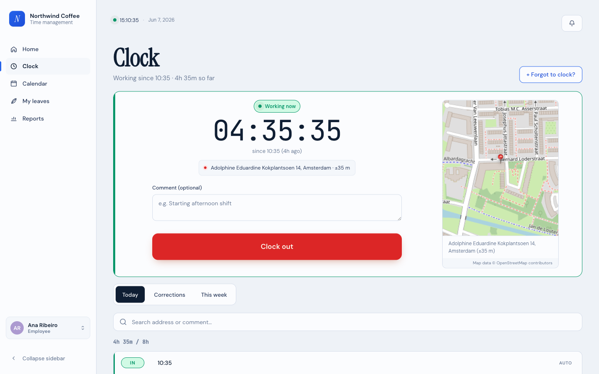
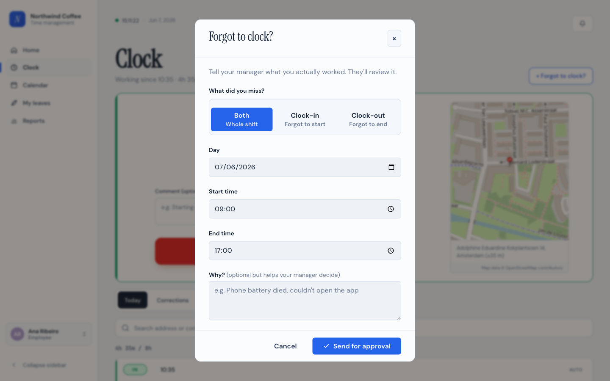
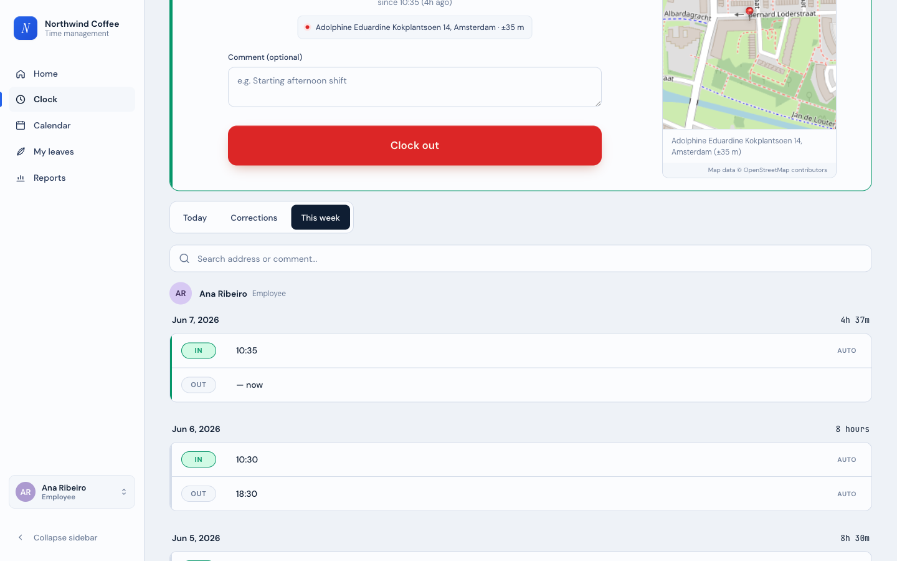
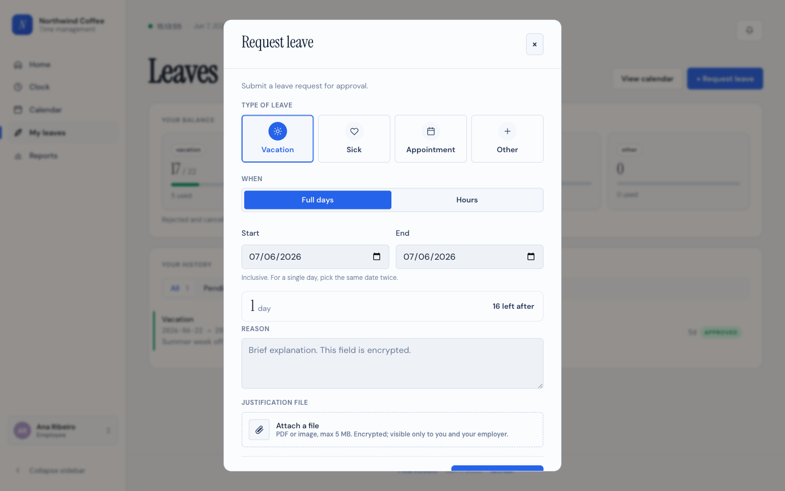
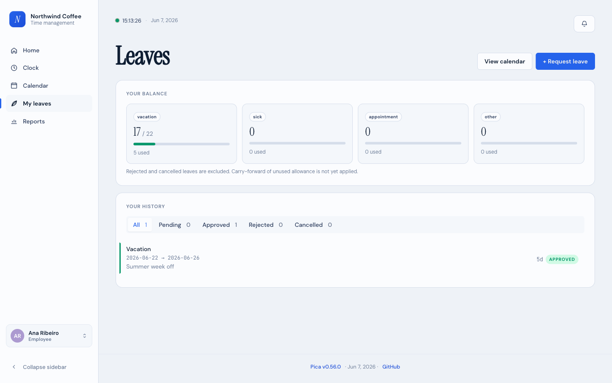
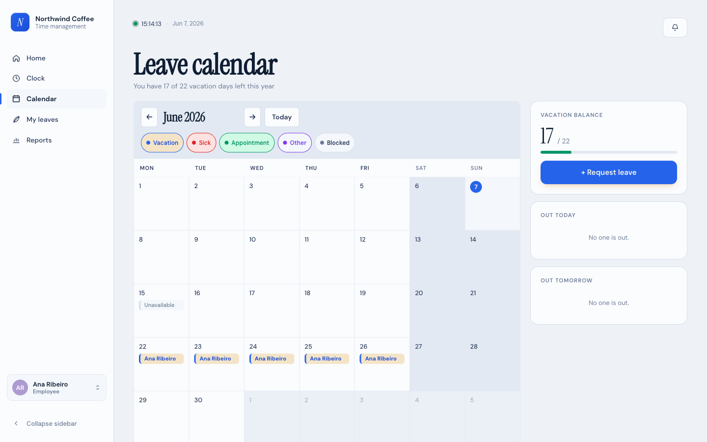
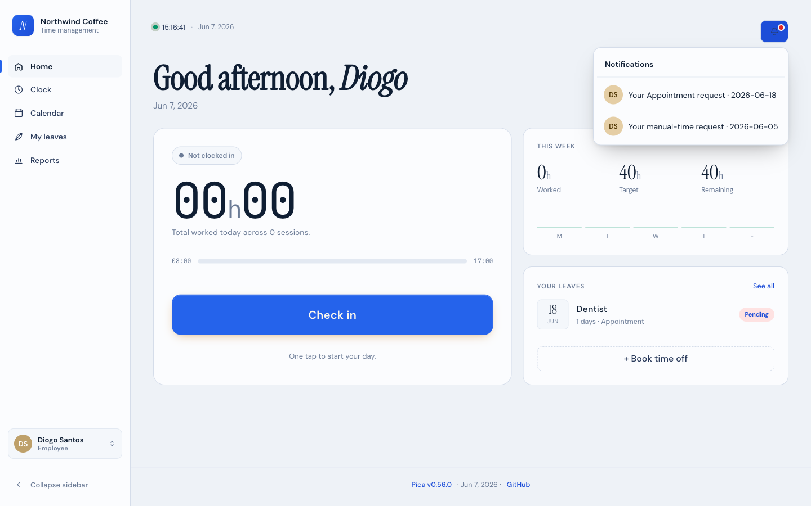
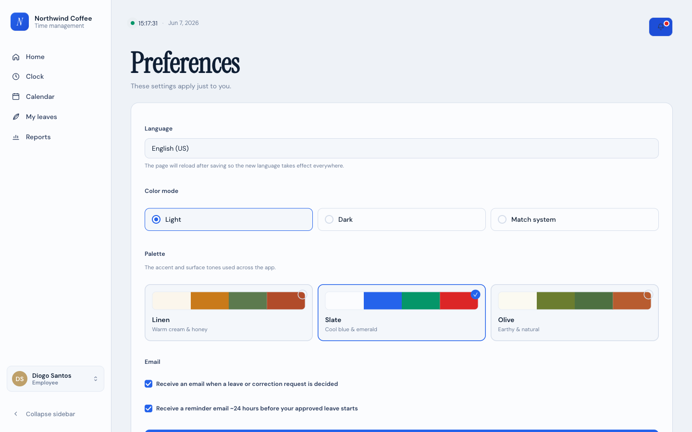

# Pica — User guide

This guide is for **employees**: the people who clock in and out, request
time off, and check their hours. It walks through everything you do in
Pica day to day. You don't need to know anything technical to use it.

If you run the company on Pica — adding people, approving requests,
changing settings — see the [Admin guide](./admin-guide.md) instead.

The screenshots use the default light theme; yours may look slightly
different if someone changed the colours or you switched to dark mode.

## Contents

- [Signing in](#signing-in)
- [Your dashboard](#your-dashboard)
- [Clocking in and out](#clocking-in-and-out)
- [Forgot to clock?](#forgot-to-clock)
- [Your week](#your-week)
- [Requesting leave](#requesting-leave)
- [Your leave balance and history](#your-leave-balance-and-history)
- [The team calendar](#the-team-calendar)
- [Notifications](#notifications)
- [Preferences](#preferences)

---

## Signing in

Your employer creates your account and gives you a **username** and a
**temporary password**. Open Pica in your browser and sign in with them.

The first time you sign in, Pica may ask you to **choose a new password**
before it lets you continue. Pick something only you know — your employer
set the temporary one and can reset it, but they can't see what you change
it to.

Forgot your password? You can't reset it yourself. Ask your employer to
reset it for you; they'll give you a new temporary one to change on your
next sign-in.

---

## Your dashboard

After signing in you land on **Home** — your day at a glance.

- The big card shows whether you're **working now** and, if so, how long
  you've been clocked in today. The button under it clocks you in or out.
- **This week** shows the hours you've worked against your target, with a
  small bar per weekday.
- **Your leaves** lists your next approved or pending time off, with a
  shortcut to **Book time off**.

The clock and date at the top update live, so you can always see the
current time.

---

## Clocking in and out

Open **Clock** from the sidebar. One button runs your whole day: it says
**Check in** when you're out and **Clock out** when you're working.

- The timer shows how long you've been clocked in since your last check-in.
- The **map** records where you were when you clocked. Your browser asks
  for permission to share your location the first time; the map and address
  come from OpenStreetMap. If you decline, you can still clock in — Pica
  just won't record a location.
- The **comment** box is optional — use it for a quick note like "started
  the afternoon shift."

Each clock-in and clock-out is saved as you go. The tabs below the clock
let you review **Today**, your time **Corrections**, and **This week**.

---

## Forgot to clock?

If you forgot to clock in or out, you don't lose the time — you ask your
employer to record it. On the Clock page, select **Forgot to clock?**

1. Choose what you missed: the **whole shift** (both ends), just the
   **clock-in**, or just the **clock-out**.
2. Pick the **day** and the **start** and **end** times you actually
   worked.
3. Optionally say **why** — it helps your employer decide.
4. Choose **Send for approval**.

The request goes to your employer. Once they approve it, the time is added
to your record. You'll see it under the **Corrections** tab while it waits.

---

## Your week

The **This week** tab on the Clock page lists each day you worked, with
your clock-in and clock-out times and a total per day, plus the total for
the week.

A day you're still working shows "— Still working" in place of a
clock-out. Use the search box to find a specific day, address, or comment.

---

## Requesting leave

To book time off, open **My leaves** and choose **Request leave** (or
**Book time off** from your dashboard).

1. Pick the **type**: Vacation, Sick, Appointment, or Other.
2. Choose **Full days** or **Hours**, then set the **start** and **end**.
   For a single day, pick the same date twice. Pica shows how many days
   you're requesting and how much allowance you'd have left.
3. Add a short **reason** if you like — this field is encrypted, so only
   you and your employer can read it.
4. Optionally **attach a file** (a PDF or image, e.g. a doctor's note).

Your request goes to your employer for approval. Sick leave is the
exception to the usual rules — you can request it even on days that are
otherwise blocked or busy, because you can't plan to be ill.

---

## Your leave balance and history

The top of **My leaves** shows your remaining allowance for each leave
type. Below it, **Your history** lists your past and upcoming requests.

Use the **All / Pending / Approved / Rejected / Cancelled** filters to
narrow the list. Each row shows the dates, type, and current status. If
your history gets long, a **Show all** link reveals the older entries.

While a request is still **pending**, you can cancel it yourself.

---

## The team calendar

**Calendar** shows the month so you can plan around your colleagues.

- **Your own** approved leave appears with your name.
- **Other people's** leave appears as a plain **"Unavailable"** block —
  you can see *that* someone is out, but not who or why. This keeps
  everyone's reasons private.
- The chips at the top filter by leave type. **Blocked** days are ones
  your employer has marked as unavailable for booking (company events,
  busy periods).
- The right-hand panel shows your remaining vacation and who's out today
  and tomorrow.

Use the arrows to change month, or **Today** to jump back.

---

## Notifications

The **bell** in the top-right corner collects things that need your
attention — usually your own requests that are still waiting on a
decision. A dot on the bell means there's something new.

Selecting an item opens its details. When a request is approved or
rejected, it drops off the list.

---

## Preferences

Open **Preferences** from your user menu (bottom-left) to set how Pica
looks and how it contacts you. These settings apply only to you.

- **Language** — English (US) or Português (PT). The page reloads when you
  save so the new language takes effect everywhere.
- **Color mode** — Light, Dark, or Match system.
- **Palette** — the accent and surface colours used across the app.
- **Email** — choose whether Pica emails you when a request is decided and
  whether you get a reminder before approved leave starts. (Email only
  works if your employer has set it up.)

Further down the page you can also **change your password**.

---

_Employees, that's everything. Employers and admins should read the
[Admin guide](./admin-guide.md)._

_Last touched in 0.57.0._
